<picture>
  <source media="(prefers-color-scheme: dark)" srcset="./dark-v2.svg">
  <source media="(prefers-color-scheme: light)" srcset="./dark-v2.svg">
  
</picture>

 

---

### 👋 Hey, I'm Vishal

I build **cloud infrastructure** and share **DevOps workflows** and automation content.

---

## 🎯 Currently

- 🔭 **Working on:** Cloud automation & DevOps projects
- 🌱 **Learning:** GitOps · Service Mesh · Observability
- ☁️ **Focused on:** AWS · Terraform · Kubernetes · CI/CD
- ⚡ **Fun fact:** I automate things so I can be lazy 😴

---

## 🛠️ Tech Stack

---

## 🎬 Featured Project

<table>
<tr>
<td width="100%">

### ☁️ Cloud & DevOps Projects
A collection of cloud and DevOps engineering work.

- **Repository:** [Attrivishal](https://github.com/Attrivishal)

</td>
</tr>
</table>

---

## 🐍 Contributions

---

### ❤️ Thanks for the support!

